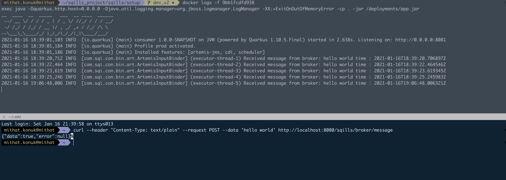

# Sqills Message Broker  Project

This project simple handle forwarding and also receive message to external systems.

### Setup

Simple Message Broker Application has small script to handle each of modules process and
containerization to run on everywhere

```shell script
cd /sqills/setup/
run ./setup.sh or sh setup  
    
    Started to build broker
[INFO] Scanning for projects...
[INFO]
[INFO] ---------------------------< com.sqills:app >---------------------------
[INFO] Building app 1.0.0-SNAPSHOT
[INFO] --------------------------------[ jar ]---------------------------------
[INFO]
[INFO] --- maven-clean-plugin:2.5:clean (default-clean) @ app ---
[INFO] Deleting /Users/mithat.konuk/sqills_project/sqills/app/target
[INFO]
[INFO] --- quarkus-maven-plugin:1.10.5.Final:generate-code (default) @ app ---
[INFO]
[INFO] --- maven-resources-plugin:2.6:resources (default-resources) @ app ---
[INFO] Using 'UTF-8' encoding to copy filtered resources.
[INFO] Copying 1 resource
....
Current directory : /Users/mithat.konuk/sqills_project/sqills/setup
Started to build consumer
Current directory : /Users/mithat.konuk/sqills_project/sqills/setup
[INFO] Scanning for projects...
[INFO]
[INFO] ------------------------< com.sqills:consumer >-------------------------
[INFO] Building consumer 1.0.0-SNAPSHOT
[INFO] --------------------------------[ jar ]---------------------------------

...
sqills_artemis_1 is created
sqills_consumer_1 is created
sqills_app_1 is created
```

setup script is simple runnable script to build all projects and then trigger docker-compose

### Run Application

Choose consumer ID from list of applications to monitor logs, after that open another terminal to
make curl as seen below.

```shell
  docker ps 
  
  
  docker logs -f CONSUMER_ID
  curl --header "Content-Type: text/plain" --request POST --data 'hello world' http://localhost:8080/sqills/broker/message
  
```

### Screenshots

List of Applications


Monitoring Application




